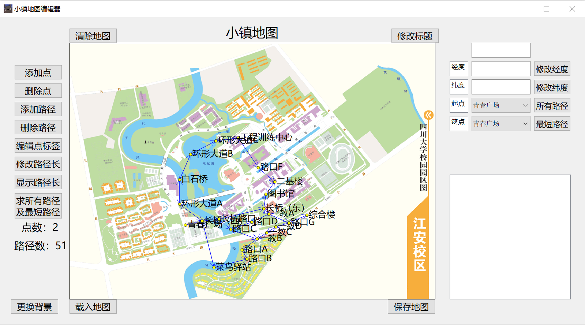

# MapEditor
This is a map editor which can calculate the min distance between two points of a map with DFS or Dijkstra. There are still some bugs with the Dijkstra algorithm. It will be fixed when I am less busy. If you are interested in solving this bug, please raise an Issue or PR, which will definately help me a lot!

## Interface Preview
Note that in this preview, the point seems not to be correspond to the map. However, if you create your own map and store it, this problem will not arise :) Sorry about that.

## Quickstart
To run this code, you have to properly install QT. Then git clone this repository and run the `.exe` file with a cute Totori icon.

## Manual
The functions of our software are introduced below:
### Add a Point
Click on the button. Then click on any point within the edit region. At the same time, you have to specify the label, latitude and longitude of this point.

**Attention:** Once after you click on the "Add point" button, it remains in this state. In other words, you do not have to click on the button as long as you are continually adding points, which saves some labour.
### Delete a Point
Click on the button. Then click on any point within the edit region. At the same time, our editor will also delete edges associated with this point. If there is information about this point showing on the right, the infomation will be cleared.
### Add a Path
Click on the button. Then click on start and end point respectively, following the prompt at the bottom of this editor. And you will get a directed path from the start point to the end one, whose length will be automatically calculated given its coordinate.
### Detele a Path
Click on the buton. Then select the start and end point, following the prompt at the bottom of this editor. And this path will be deleted.
### Edit Point Label
Click on the button. Then select any point within the edit region. And a dialogue box to edit the label will appear.
### Modify Path Length
Click on the button. Then select the start and end point, following the prompt at the bottom of this editor. And a dialogue box to modify path length will appear.
### Show/Hide Path Length
Click on the button to show/hide the lengths of all paths, which will be shown near the end of the arrow.

**Attention**
When there are too many paths, their length number may be overlap. Therefore, we recommend our user to hide the path length.
### Calculate all Paths and the Shortest Path
Click on the button. Select the start and end point, following the prompt at the bottom of this editor. Our algorithm will searc for every path according to DFS and show the shortest one.

**Attention**
When the number of all the paths is greater than 20,000, in order to avoid the collapse of our software, this function is disabled automatically.
### Clear Map
Click on the button to clear the edit region and the informaton region on the right. Be careful!
### Change Background
Click on the button to select new background image.
### Load Map
Click on the button to select saved map.

**Attention**
The background may not be loaded due to `File Not Found Error`.
### Save Map
Click on the button to save map of existing working edit region.
### Change Header
Click on the button to change the header of this map, which, in default, is 'A Town Map'.
### Change Latitude
First, select the point to be modified. You can do this by either clicking on the point in the edit region or correctly input the label of this point in the first text box. Then input latitude in the text box, and click on the button to show a prompt of "Changing Latitude" and "Renew Paths".
### Change Longitude
First, select the point to be modified. You can do this by either clicking on the point in the edit region or correctly input the label of this point in the first text box. Then input longitude in the text box, and click on the button to show a prompt of "Changing Longitude" and "Renew Paths".
### Show all Paths
Click on the button. Select the start and end point, following the prompt at the bottom of this editor. And then our editor will search for all the paths connecting these two points with DFS and show the shortest one.
### Shortest Path
Click on the button. Select the start and end point, following the prompt at the bottom of this editor. And then our editor will calculate the shortest path between these two points with Dijkstra,

## Acknowledgement
This codebase is based on this tutorial from Bilibili: https://www.bilibili.com/video/BV1k64y1W73o/?share_source=copy_web&vd_source=d0c35bd945166518afac48af8599f9c1. It also has a step-by-step code explanation. The origional codebase can also be found in the comments of the video. If you want to better understand this project, we strongly recommend you to watch the two videos provided by this UP.